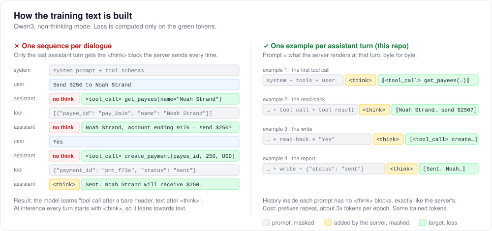
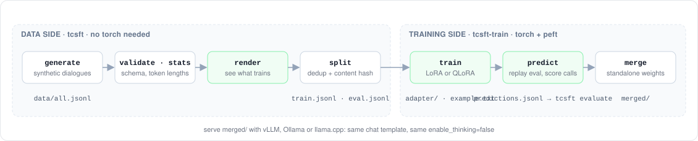
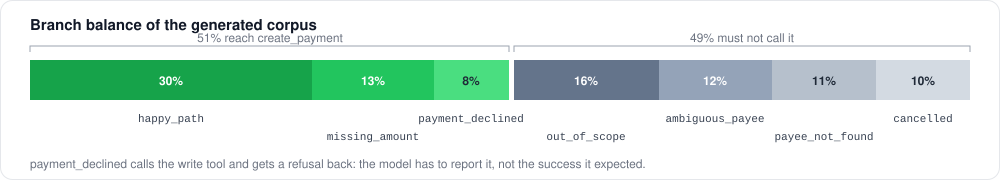

<div align="center">

# toolcall-sft

**Fine-tune a small local LLM to make the right tool call, on a laptop,<br>with the exact prompt your inference server will render.**

[](https://github.com/SergeyShk/toolcall-sft/actions/workflows/ci.yml)
[](LICENSE)




</div>

Tool-calling fine-tunes fail quietly. The model trains on text that is *almost* what the server
renders at inference, and the difference shows up later as a model that hesitates to call tools or
calls the wrong one. This repository is a small, readable pipeline that gets that part right,
demonstrated end to end on one scenario: a payment assistant with three tools.

## Highlights

- **One training example per assistant turn.** The prompt of each example is exactly what vLLM or
  Ollama builds at that turn; the target is what the model has to produce. Qwen3's `<think>` block
  is the concrete case the diagram above shows, and `tcsft render` prints the real bytes.
- **Loss only where it belongs.** Prompt tokens must be a prefix of the example, content must appear
  verbatim, or tokenization fails loudly instead of training on a misaligned target.
- **Balanced synthetic data out of the box.** Seven dialogue branches, half of which must *not* call
  the write tool. `git clone` to a trained adapter in one `make demo`.
- **Scored per decision, not per token.** `tcsft-train predict` replays the held-out dialogues
  turn by turn and `tcsft evaluate` reports turn accuracy, false fires, missed calls and per-tool
  argument accuracy, for the tune and for the untuned base.
- **Laptop first.** Qwen3-0.6B with LoRA on Apple Silicon by default; the same config picks up CUDA
  or falls back to CPU. QLoRA config for an 8B model on one GPU.
- **No framework.** `transformers.Trainer` + `peft`, about 2000 lines you can read in an afternoon,
  strict typing, offline tests.

## Quickstart

```bash
git clone https://github.com/SergeyShk/toolcall-sft && cd toolcall-sft
uv sync
make demo        # generate → validate → stats → render → split → train → predict
```

Step by step:

```bash
# 1. Synthetic dialogues for the example scenario (deterministic in --seed)
uv run tcsft generate --out data/all.jsonl --count 300

# 2. Schema check and token lengths under the base model's tokenizer
uv run tcsft validate data/all.jsonl
uv run tcsft stats data/all.jsonl --config configs/mac_mps.yaml

# 3. Look at what the model will train on: one example per assistant turn, loss tokens in ⟦ ⟧
uv run tcsft render data/all.jsonl --config configs/mac_mps.yaml

# 4. Dedup and split by content hash
uv run tcsft split data/all.jsonl --train-out data/train.jsonl --eval-out data/eval.jsonl

# 5. Train a LoRA adapter, then merge it into the base model
uv run tcsft-train train --config configs/mac_mps.yaml
uv run tcsft-train merge --adapter outputs/payments-qwen3-0.6b-lora/adapter \
                         --output  outputs/payments-qwen3-0.6b-lora/merged

# 6. Replay the held-out dialogues through the adapter and score every turn; same command with
#    --model <base> for the untuned baseline
uv run tcsft-train predict --config configs/mac_mps.yaml
uv run tcsft-train predict --config configs/mac_mps.yaml --model Qwen/Qwen3-0.6B \
                           --out outputs/payments-qwen3-0.6b-lora/predictions.base.jsonl
uv run tcsft evaluate outputs/payments-qwen3-0.6b-lora/predictions.jsonl --show 10

# 7. Serve (OpenAI-compatible); every request carries "chat_template_kwargs": {"enable_thinking": false}
vllm serve outputs/payments-qwen3-0.6b-lora/merged --enable-auto-tool-choice --tool-call-parser hermes
```

On an Apple M3 Pro the training step of `make demo` takes about an hour (300 dialogues → 975
examples, 2 epochs, 218 steps) and ends at a held-out loss of 0.064. A CUDA GPU is an order of
magnitude faster. Details and memory levers: [docs/HARDWARE.md](docs/HARDWARE.md).

## How it works



| Step | What it does |
|---|---|
| `tcsft generate` | Writes branch-balanced synthetic dialogues. Deterministic, deduplicated, refuses to repeat itself. |
| `tcsft validate` | Schema check: roles, tool calls, every call answered before the next turn. Prints a tool-call census. |
| `tcsft stats` | Longest example per dialogue (must fit `max_seq_length`), tokens per epoch, trained-token share. |
| `tcsft render` | A dialogue exactly as the trainer sees it, with the loss span marked. Look at this before every run. |
| `tcsft split` | Dedup + deterministic content-hash split, with a per-branch breakdown of the eval side. |
| `tcsft-train train` | LoRA/QLoRA with `transformers.Trainer`. Writes `config.yaml`, `run.json` and `example.txt` next to the checkpoints. |
| `tcsft-train predict` | Replays every assistant turn of a dialogue set through a model (adapter, merged checkpoint or untuned base), greedy, from the reference history. Writes `predictions.jsonl` and prints the score. |
| `tcsft evaluate` | Scores a predictions file: turn accuracy, false fires and missed calls, per-tool precision and recall, argument accuracy, calls that would run. `--show` prints the wrong turns with the raw output. |
| `tcsft-train merge` | Folds the adapter into the base weights (fp32 merge, bf16 once) for standalone serving. |

`tcsft` needs no torch; transformers is imported only by the commands that render a chat template.

### The one thing this gets right

Chat templates render *history* and the *generation prompt* differently. Qwen3 in non-thinking
mode inserts an empty `<think>` block before the generation prompt but keeps it only on the last
assistant turn when rendering history. Render a whole dialogue once and mask the assistant turns,
and every tool-call turn is trained on a prompt the server never builds. So each assistant turn
becomes its own example:

```
prompt  = apply_chat_template(messages[:k], tools, add_generation_prompt=True, enable_thinking=False)
target  = apply_chat_template(messages[:k+1], tools)[len(prompt):]      # content + tool calls + <|im_end|>
labels  = [-100] * len(tokens(prompt)) + tokens(target)
```

with three checks that raise instead of guessing: the rendered turn must extend the prompt, the
content and tool names must appear verbatim in the target, and the prompt's tokens must be a
prefix of the example's tokens. The price is repeated prefixes, about 3x tokens per epoch on this
scenario; the trained tokens are the same. `dataset.chat_template_kwargs` carries the template
flags, so training and serving cannot disagree about the mode.

This is what `tcsft render` prints for the second turn of a `happy_path` dialogue (tools block
above, unchanged in every example):

```
<|im_start|>user
Send $40.00 to James Whitfield<|im_end|>
<|im_start|>assistant
<tool_call>
{"name": "get_payees", "arguments": {"name": "James Whitfield"}}
</tool_call><|im_end|>
<|im_start|>user
<tool_response>
[{"payee_id": "pay_7f0182f1dd", "name": "James Whitfield", "account_number": "82545769"}]
</tool_response><|im_end|>
<|im_start|>assistant
<think>

</think>

⟦Ready to send $40.00 to James Whitfield, account ending 5769. Confirm?<|im_end|>
⟧
```

The earlier tool call sits in the history without a think block, the generation prompt ends with
one, and loss starts at the first character the model must produce and ends after the terminator.

## The example scenario

A payment assistant for a small-business banking app. One system prompt
([system_prompt.txt](src/toolcall_sft/system_prompt.txt)) and three tools
([scenario.py](src/toolcall_sft/scenario.py)):

| Tool | Role in the tune |
|---|---|
| `get_payees(name)` | a lookup whose result decides what happens next: no match, one match, several |
| `create_payment(payee_id, amount, currency, reference?)` | a write that must not fire without confirmation, and can come back declined |
| `escalate(reason)` | the way out for everything else; without it a narrow model answers questions it should not |



A model trained only on the happy path learns that the write tool is the answer to everything; one
never shown a refusal learns to report a success it did not get. The generator caps at about 2060
dialogues with the default weights and says so when asked for more. Twenty dialogues covering all
seven branches are committed in [examples/](examples/dialogues.sample.jsonl).

## Bring your own data

One dialogue per JSONL line; tool calls flat, converted to the OpenAI nested form at render time:

```json
{
  "dialogue_id": "happy_path-00001",
  "messages": [
    {"role": "system", "content": "You are a payment assistant..."},
    {"role": "user", "content": "Send $450.00 to James Whitfield"},
    {"role": "assistant", "content": "", "tool_calls": [{"name": "get_payees", "arguments": {"name": "James Whitfield"}}]},
    {"role": "tool", "content": "[{\"payee_id\": \"pay_1c9f\", \"name\": \"James Whitfield\"}]"},
    {"role": "assistant", "content": "James Whitfield — send $450.00?"}
  ],
  "tools": [{"type": "function", "function": {"name": "get_payees", "description": "...", "parameters": {"...": "..."}}}]
}
```

Tool descriptions are rendered into the prompt, so they are part of what the model learns from.
Tool-call `id` / `tool_call_id` are optional and pass through to templates that need them
(Mistral); nothing is invented when they are absent.

Replace `scenario.py` and `system_prompt.txt` with your own, emit JSONL in this shape, and run the
same commands. If the dialogues come from a real system, anonymize first:

```bash
uv run tcsft anonymize data/raw.jsonl --out data/anon.jsonl --term "Some Name"
```

Deterministic pseudonymization: structured identifiers by regex, names harvested from tool payloads
(whole-word replacement, consistent across turns), amounts kept. It is a mechanical pass, not a
guarantee; read a sample. Details: [anonymizer.py](src/toolcall_sft/anonymizer.py) and
[docs/DATASET.md](docs/DATASET.md).

## Configuration

Two configs ship: [configs/mac_mps.yaml](configs/mac_mps.yaml) (the default) and
[configs/cuda_qlora.yaml](configs/cuda_qlora.yaml) (Qwen3-8B in 4-bit; needs `uv sync --group cuda`,
not yet run end to end by the author). Unknown keys are errors, not no-ops.

| Key | Default | Notes |
|---|---|---|
| `dataset.max_seq_length` | required | Per example; the last turn of a dialogue is the longest. Over-long dialogues are refused by id, run `tcsft filter --config`. |
| `dataset.chat_template_kwargs` | `{enable_thinking: false}` | Passed to the template for prompt and target. Ignored by templates that do not read it. |
| `lora.r` / `lora.alpha` / `lora.dropout` | required / required / 0.05 | Adapters on all linear projections by default. |
| `training.device` | `auto` | `cuda` → `mps` → `cpu`. A requested device that is missing is an error. |
| `training.precision` | `auto` | bf16 on an accelerator, fp32 on CPU. LoRA parameters stay fp32 on MPS. |
| `training.eval_batch_size` | = train batch | Eval logits span the whole vocabulary; see [docs/HARDWARE.md](docs/HARDWARE.md). |
| `training.load_in_4bit` / `use_liger_kernel` | `false` | CUDA only; refused up front elsewhere. |
| `tracking.report_to` | `[]` | Add `["mlflow"]` and `mlflow_experiment` to log params, config and metrics. |

[config.py](src/toolcall_sft/config.py) is the authority. Every run leaves `config.yaml`,
`run.json` (resolved device, dataset sizes, versions, git state) and `example.txt` in its output
directory.

## Evaluation

Loss stops being informative once the model has the format. The question is whether it makes the
right call, and `tcsft-train predict` answers it per turn:

- **Teacher-forced, greedy.** Every assistant turn is generated from the reference history, with
  the same prompt the trainer built for that turn, so each decision is scored on its own and a
  mistake early in a dialogue does not hide the turns after it. Greedy, so the number is
  reproducible. What this does not measure is how the model recovers from its own mistakes; that
  needs a tool simulator driving the served model.
- **Turn accuracy** is the headline: the calls are exactly the reference calls (order-insensitive),
  and nothing failed to parse. Free text is not scored.
- **False fires and missed calls.** A call where the reference replies with text, and the reverse.
  The negative branches exist to measure the first one.
- **Per tool and per branch.** Precision, recall and argument accuracy by tool; turn accuracy by
  branch of the generator (the `dialogue_id` prefix). Argument accuracy is over the expected calls
  that found a partner by name. A rate with nothing to divide by prints `—`.
- **Would it run.** `<tool_call>` blocks that do not parse, and calls that parse but fail their
  tool's schema: unknown tool, missing required argument, undeclared argument, wrong type, value
  outside an `enum`. A dialogue that declares no `tools` is checked against nothing; its calls are
  recorded unchecked.

On the held-out split of the default run (33 dialogues, 106 assistant turns), greedy, scored on an
M3 Pro. The middle column is the same config trained with the whole-dialogue rendering the diagram
at the top warns about, on an earlier revision of the generator: it learned that a `<think>` block
means "reply", so it stopped calling tools once the server started inserting one.

| | Qwen3-0.6B, untuned | + LoRA, whole-dialogue render | + LoRA, per-turn (this repo) |
|---|---|---|---|
| Turn accuracy | 74.5% | 58.5% | **96.2%** |
| Missed calls, of 50 call turns | 19 | 44 | 0 |
| False fires, of 56 reply turns | 0 | 0 | 0 |
| `get_payees` exact recall | 0.75 | 0.00 | 1.00 |
| `create_payment` exact recall | 0.12 | 0.35 | 1.00 |
| `escalate` exact recall | 0.00 | 0.00 | 0.20 |

The per-turn model's four misses are all `escalate`: its `reason` argument is free text and the
model paraphrases it, so exact match is the wrong yardstick there. The synthetic split is
low-entropy, so a tune should sit near the ceiling on it; the table that matters is this one on
real dialogues.

`predictions.jsonl` has one record per turn: expected and predicted calls, the schema problems of
each predicted call, the raw output, and the content on both sides; a `.meta.json` next to it
records the model, decoding, versions and git state. `tcsft evaluate --show 10` prints the wrong
turns with the raw output, `--json` the full report. The format is plain enough to write from any
other harness and score the same way; the minimum is `{"expected": [...], "predicted": [...]}` per
line.

## Serving

The merged model is a standard HF checkpoint with the tokenizer and chat template training used.
Two things it does not carry: the **mode** (a Qwen3 tune from this pipeline is only valid with
`enable_thinking: false`; pass it per request or as the server's default) and **sampling
parameters** (`generation_config.json` is inherited from the base; Qwen recommends temperature
0.7, top_p 0.8, top_k 20 for non-thinking mode).

## Documentation

- [docs/FINETUNING.md](docs/FINETUNING.md): task framing, base models, method, evaluation, serving,
  and the traps in the order people hit them.
- [docs/DATASET.md](docs/DATASET.md): how much data, which branches, token budget, keeping the
  split honest, bringing your own dialogues.
- [docs/HARDWARE.md](docs/HARDWARE.md): measured runs, model size, memory on MPS.
- [CONTRIBUTING.md](CONTRIBUTING.md): setup, conventions, scope.

## Development

```bash
make test   # pytest, offline; includes a training smoke test on a tiny model when torch is installed
make lint   # ruff format --check, ruff check, pyright --strict
make fmt
```

```
src/toolcall_sft/
├── schema.py        dialogue model, validation, fingerprint
├── dataset.py       JSONL, dedup, deterministic split
├── scenario.py      the example prompt + tools  ← replace these two
├── system_prompt.txt
├── generate.py      branch-balanced synthetic dialogues
├── masking.py       per-turn, chat-template-exact examples
├── stats.py         token statistics, length filter
├── anonymizer.py    deterministic pseudonymization
├── parsing.py       tool calls out of generated text, schema check
├── metrics.py       turn accuracy, false fires, per-tool precision / recall
├── config.py        typed experiment YAML
├── cli.py           tcsft
├── train_cli.py     tcsft-train
└── training/        sft.py, predict.py, merge.py  (the only part that needs torch)
```

## License

Apache-2.0. Copyright 2026 Sergei Shkarin.
